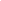
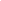

# Ghidra PLC Analysis Tools

<p align="center"><strong>PLC-oriented function recovery, source matching, decompilation, and in-Ghidra analysis helpers.</strong></p>

<p align="center">
  
  
  
</p>

## Overview

This repository contains two complementary Ghidra Java scripts for recovering and understanding native PLC code.

| Script | Purpose |
|---|---|
| [`AnalyzePLCProgramPlusV2.java`](ghidra_scripts/AnalyzePLCProgramPlusV2.java) | Main analysis tool with confidence-gated recovery, PLC toolchain detection, Structured Text matching, bookmarks, detailed reports, and decompiler exports |
| [`RecoverAndDecompilePLC.java`](ghidra_scripts/RecoverAndDecompilePLC.java) | Quick-and-dirty helper that stays entirely inside Ghidra and attempts to recover and decompile as much native code as possible |

Recommended workflow:

```text
PLC code file
→ import into Ghidra
→ determine raw-binary processor settings when necessary
→ run one of the scripts
→ inspect recovered functions, assembly, decompiler output, bookmarks, and reports
```

Neither script modifies executable bytes.

---

## Screenshot placeholders

Replace the placeholder files in [`screenshots/`](screenshots/) with your own images while keeping the filenames.

### Main analysis tool

<!-- Suggested screenshot: script dialog, PLC-AUTO bookmarks, recovered function, and generated report folder. -->



> Suggested caption: `AnalyzePLCProgramPlusV2` recovering functions, ranking source matches, and organizing high-confidence findings.

### Quick recovery helper

<!-- Suggested screenshot: completion dialog, Functions window, PLC Recovery bookmarks, and Decompiler output. -->



> Suggested caption: `RecoverAndDecompilePLC` performing broad in-Ghidra function discovery and decompiler preparation.

---

## Why this project exists

PLC binaries can be difficult to analyze because they may use proprietary containers, raw machine-code images, stripped symbols, unusual calling conventions, runtime-resolved helpers, compiler wrappers, and code mixed with metadata or literal pools.

The main tool emphasizes **confidence, explainability, source matching, and structured evidence**. The quick helper emphasizes **minimal input and broad function recovery inside Ghidra**.

# Tools

## 1. AnalyzePLCProgramPlusV2

The primary tool supports:

- CODESYS v3, GEB, OpenPLC v2/v3, generic OpenPLC, and unknown PLC triage
- import and architecture preflight checks
- confidence-gated CODESYS ARM function recovery
- automatic Structured Text and metadata pairing
- source-to-binary candidate ranking
- PLC-specific labels, comments, and bookmarks
- direct and indirect call analysis
- literal-pool detection
- variable read/write classification
- normalized instruction fingerprints
- duplicate-function grouping
- HTML, CSV, Markdown, assembly, and decompiler exports

### Profiles

| Profile | Behavior |
|---|---|
| **Automatic Safe** | Recommended; applies only confidence-gated changes |
| **Report Only** | Creates reports without changing the Ghidra project |
| **Deep Report** | Expands report-only analysis and candidate selection |
| **Custom** | Allows individual feature selection |

### Typical output

```text
sample_plc_plus_YYYYMMDD_HHMMSS/
├── preflight.md
├── plc_analysis_summary.md
├── toolchain_detection.csv
├── source_function_candidates.csv
├── function_inventory.csv
├── core_functions.md
├── call_edges.csv
├── indirect_calls.csv
├── variable_access.csv
├── literal_pools.csv
├── function_fingerprints.csv
├── report.html
├── ANALYSIS_WARNINGS.md
└── core_function_details/
    ├── SELECTION_README.md
    └── <address>_<function>/
        ├── selection.md
        ├── metadata.md
        ├── decompile.c
        ├── assembly.asm
        ├── normalized.txt
        └── calls.md
```

See [`docs/MAIN_TOOL.md`](docs/MAIN_TOOL.md).

## 2. RecoverAndDecompilePLC

The quick helper creates no report directory and asks for no source paths or output locations. It:

1. runs Ghidra auto-analysis;
2. finds candidates from symbols, calls, block starts, PLC names, and architecture prologues;
3. validates candidates with `PseudoDisassembler`;
4. disassembles accepted code and creates functions;
5. repeats recovery through newly discovered calls;
6. scans aligned gaps on suitable small raw binaries;
7. runs incremental analysis and Decompiler Parameter ID;
8. attempts to decompile every non-external function;
9. creates `PLC Recovery/` bookmarks;
10. navigates to a likely PLC or recovered function.

See [`docs/QUICK_HELPER.md`](docs/QUICK_HELPER.md).

# Installation

## Windows

Run:

```text
install\install_windows.bat
```

## Linux or macOS

```bash
chmod +x install/install_unix.sh
./install/install_unix.sh
```

## Manual installation

Copy both files from [`ghidra_scripts/`](ghidra_scripts/) into a Ghidra script directory, commonly:

```text
Windows: C:\Users\<username>\ghidra_scripts
Linux/macOS: ~/ghidra_scripts
```

Then open **Window → Script Manager**, refresh, and search under **PLC Analysis**.

# Quick start

## Careful analysis

1. Import the PLC file.
2. For raw binaries, select the correct processor, bitness, endianness, instruction mode, and image base.
3. Run `AnalyzePLCProgramPlusV2.java`.
4. Select **Automatic Safe**.
5. Read `preflight.md` first.
6. Review bookmarks, source candidates, and `core_function_details/`.
7. Compare decompiled C against assembly before renaming functions.

## Quick recovery

1. Import the PLC file.
2. Run `RecoverAndDecompilePLC.java`.
3. Open **Window → Functions** and **Window → Bookmarks**.
4. Filter bookmarks for `PLC Recovery/`.
5. Select recovered functions and inspect the Decompiler.

# Which script should I use?

| Situation | Script |
|---|---|
| Known or suspected CODESYS/GEB/OpenPLC binary | Main tool |
| Paired Structured Text is available | Main tool |
| Research or coursework evidence is needed | Main tool |
| Toolchain is unknown | Quick helper first |
| Results should stay entirely inside Ghidra | Quick helper |
| Broad initial function recovery is the priority | Quick helper |

The scripts can be used sequentially:

```text
RecoverAndDecompilePLC
→ inspect broad recovery
→ AnalyzePLCProgramPlusV2
→ generate structured evidence
```

# Raw binary imports

For a raw binary, determine as accurately as possible:

- processor family and version
- bitness
- endianness
- ARM versus Thumb default mode
- image base
- file offset mapping

An incorrect language can produce valid-looking but meaningless instructions.

A CODESYS ARM sample may use `ARM:LE:32:v7` at image base `0`, but that should not be assumed for unrelated files.

# Understanding results

Disassembly converts bytes to instructions. Function creation groups instructions into callable functions. Decompilation produces C-like pseudocode from those functions.

Decompiler output can be misleading when a PLC binary uses a proprietary calling convention, stack-based call frames, unresolved runtime pointers, missing relocations, or stripped types. Assembly remains the stronger source of evidence.

# Repository structure

```text
ghidra-plc-analysis-tools/
├── README.md
├── LICENSE
├── CHANGELOG.md
├── CONTRIBUTING.md
├── SECURITY.md
├── ghidra_scripts/
├── docs/
├── examples/
├── screenshots/
├── install/
└── .github/
```

# Limitations

These tools are not a universal PLC decompiler. They cannot automatically solve encrypted containers, compressed packages, unsupported bytecode, incorrect architecture settings, missing proprietary relocations, runtime-only resolution, or exact Ladder Logic reconstruction.

# Safety and intended use

Use only for authorized research, coursework, defensive analysis, public datasets, labs, and personally controlled systems. Do not deploy unknown binaries to production PLCs or industrial systems.

# License

Released under the [MIT License](LICENSE).

# Disclaimer

Automated reverse-engineering results must be manually verified before being treated as authoritative.
